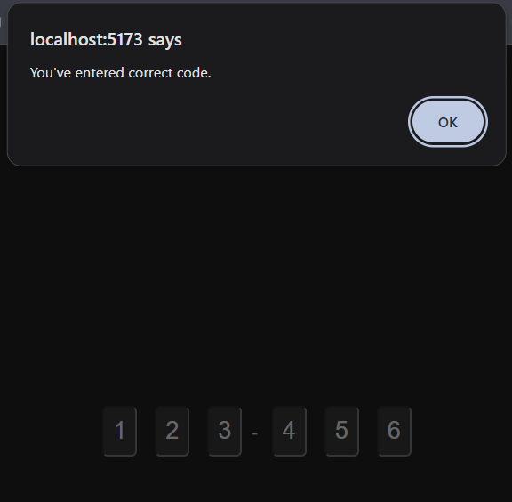
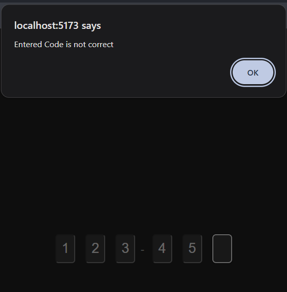
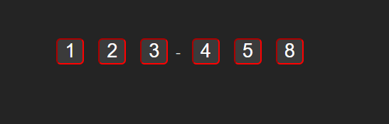

# CodeVer
A react component to handle 6 code verification with different options
- Allow Numbers Only
- Allow Numbers and Alpha 
- Allow Alpha Only
- Custom css class for the Code cells
- Custom splitter character

- Build & run Steps
  ```
  npm install
  npm run dev
  ```

- Screenshot
### Valid Code 


### Invalid Code


### Custom CSS Class for Text Cell

```js
 <CodeVer expectedCode={"123456"} onValid={onValid} onFail={onFail}
        allowedPattern={AllowedPattern.NumbersOnly}
        cellCssClass={"cell"}
      />
```

### Custom Splitter Character

```js
      <CodeVer expectedCode={"123456"} onValid={onValid} onFail={onFail}
        allowedPattern={AllowedPattern.NumbersOnly} splitChar='+'
      />
```
